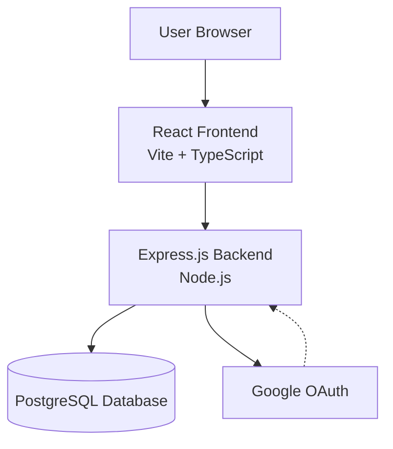

```mermaid
graph TB
    User[User Browser]
    Frontend[React Frontend<br/>Vite + TypeScript]
    Backend[Express.js Backend<br/>Node.js]
    Database[(PostgreSQL Database)]
    Google[Google OAuth]
    
    User --> Frontend
    Frontend --> Backend
    Backend --> Database
    Backend --> Google
    Google -.-> Backend
```

